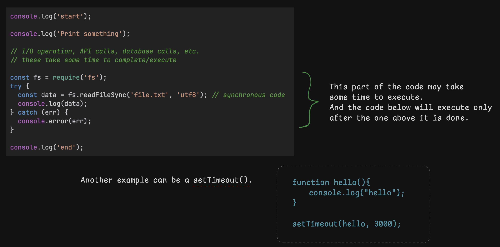

`async await >> promise chains >> callback hell`

## Synchronous code

The code runs in a particular sequence and waits for the result of each step before moving on to the next step.

### Example 1:

```js
var x = 1;
var y = 2;
var z = x + y;
console.log(x);
console.log(y);
console.log(z);
```

### Example 2: (Synchronous code)

```js
console.log('start');

console.log('Print something');

// I/O operation, API calls, database calls, etc.
// these take some time to complete/execute

const fs = require('fs');
try {
  const data = fs.readFileSync('file.txt', 'utf8'); // synchronous code
  console.log(data); 
} catch (err) {
  console.error(err);
}

console.log('end');
```



### Problems with synchronous code

- Causes the program to freeze while waiting for the I/O operation to complete
- Causes delay in the program execution
- Does not block the flow of the program

## What are callbacks?

A `callback` is a function that is passed as an argument to another function and is executed once an event has occurred or a certain condition is met.

### Example:
```js
function difference(a, b){
  return a - b;
}

function sum(a, b){
  return a + b;
}

function calculator(a, b, callback){
  const result = callback(a, b);
  return result;
}

console.log(calculator(3, 2, sum));
console.log(calculator(3, 2, difference));
```
### Similarly here `hello()` is a callback function
```js
function hello(){
    console.log("Hello");
}

setTimeout(hello, 1000);
```
or  
```js
setTimeout(function(){
    console.log("Hello");
}, 1000);
```
or 

```js
setTimeout(() => {
    console.log("Hello");
}, 1000);
```
The `setTimeout()` takes a callback function as an argument and executes it after the specified time which is 1000 milliseconds in this case.

## What is Callback hell?

The `callback hell` is a situation where you have to write a lot of nested callbacks to achieve the desired result.

### Example:
```js
console.log('Start');

// Simulating an API call to fetch a user from the database
function getUser(userId, callback) {
  setTimeout(() => {
    console.log('Fetched user');
    callback({ userId: userId, username: 'mounish' });
  }, 1000);
}

// Simulating an API call to fetch posts for a user
function getPosts(userId, callback) {
  setTimeout(() => {
    console.log('Fetched posts');
    callback([{ postId: 1, content: 'Hello World' }, { postId: 2, content: 'Callback Hell!' }]);
  }, 1000);
}

// Simulating an API call to fetch comments for a post
function getComments(postId, callback) {
  setTimeout(() => {
    console.log('Fetched comments');
    callback(['Great post!', 'Very informative.']);
  }, 1000);
}

// Chaining the callbacks
getUser(1, (user) => {
  console.log('User:', user.username);

  getPosts(user.userId, (posts) => {
    console.log('Posts:', posts);

    getComments(posts[0].postId, (comments) => {
      console.log('Comments on first post:', comments);

      getComments(posts[1].postId, (comments) => {
        console.log('Comments on second post:', comments);
        console.log('End');
      });
    });
  });
});
```

### Output:
```
Start
Fetched user
User: mounish
Fetched posts
Posts: [ { postId: 1, content: 'Hello World' }, { postId: 2, content: 'Callback Hell!' } ]
Fetched comments
Comments on first post: [ 'Great post!', 'Very informative.' ]
Fetched comments
Comments on second post: [ 'Great post!', 'Very informative.' ]
End
```

- As you can see that the code is hard to read and understand. 
- The code is also hard to maintain and debug.
- This is the problem of callback hell.

PS: I know this is not the best example but it is just to explain the concept, I myself spent some time looking at the code to understand what's happening

To solve the problem of callback hell, we use `Promises` and `async await`.

## What are Promises?

A `Promise` is an object that represents the eventual completion (or failure) of an asynchronous operation, and its resulting value.

.then() and .catch() are the two functions that are used to handle the result of the promise.

```
promise.then( (res) => {...} )
promise.catch( (err) => {...} )
```
```js
promise.finally( () => {...} ) 
// This is called always after the success or error callbacks
```

### Example:
```js
function sum(a, b) {
  return a + b;
}

function difference(a, b) {
  return a - b;
}

function calculator(a, b, fn) {
  return new Promise((resolve, reject) => {
    try {
      const result = fn(a, b);
      resolve(result);
    } catch (error) {
      reject("error occured");
    }
  });
}

calculator(3, 2, sum)
  .then((result) => {
    console.log("Sum:", result);
  })
  .catch((error) => {
    console.error("Error:", error);
  });

calculator(3, 2, difference)
  .then((result) => {
    console.log("Difference:", result);
  })
  .catch((error) => {
    console.error("Error:", error);
  });
```
### Output:
```
Sum: 5
Difference: 1
```

